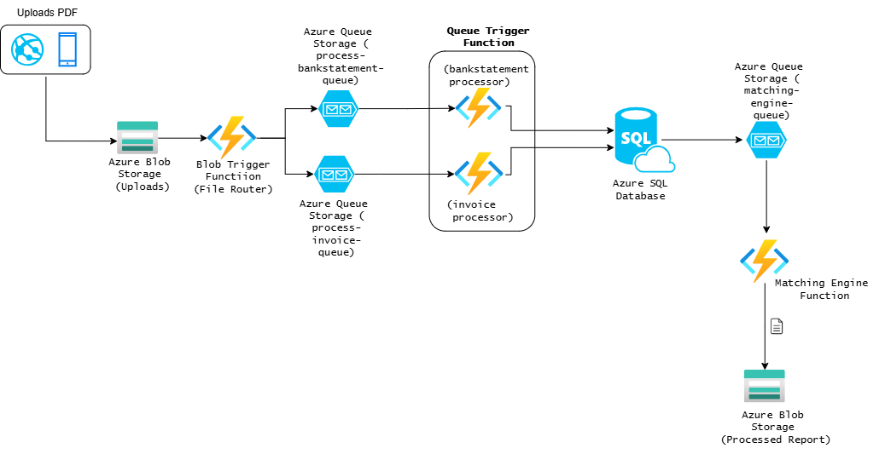

# 📂 TaxMate - Automated Invoice & Bank Transaction Matcher

A cloud-native backend solution built with **.NET 8**, **Azure Functions**, **Azure AI Document Intelligence**, and **Clean Architecture** that automates matching scanned invoices to bank transactions for tax return purposes.

---

## 🔍 Problem Statement

Manually matching years of invoices to transactions across multiple bank statements is time-consuming and error-prone. **TaxMate** solves this by:

- Extracting data from **PDF bank statements** and **invoices**
- Storing transactions and invoices metadata
- Matching invoices to transactions using identifiers (invoice number, customer ID, etc.)
- Exporting results to **Excel**
- Built to be scalable, testable, and Azure-ready

---

## 🧱 Architecture Overview



### Key Concepts

| Layer              | Responsibility                                                                 |
|--------------------|---------------------------------------------------------------------------------|
| **Domain**         | Core business logic (e.g. `BankStatment`, `BankTransaction`, `invoice`, `MatchResult`) |
| **Application**    | Use cases, DTOs, interfaces (no framework dependencies)                         |
| **Infrastructure** | Azure Storage, Azure AI Document Intelligence, EF Core persistence              |
| **Functions**      | Blob Triggers, Queue Triggers                                 |

---

## ☁️ Azure Services Used

| Service                     | Purpose                                      |
|-----------------------------|----------------------------------------------|
| **Azure Blob Storage**      | File uploads (bank statements, invoices)     |
| **Azure Queue Storage**     | Event-driven function coordination           |
| **Azure SQL Database**      | Persistent storage via EF Core               |
| **Azure Functions**         | Event triggers, processing & orchestration   |
| **Azure AI Document Intelligence**   | Table/Invoice text extraction     |

---

## ✅ Features

- 🧾 Upload **bank statements** and **invoices** (PDFs)
- 🧠 Use OCR and table parsers to extract structured data
- 🔄 Match receipts to bank transactions based on heuristics
- 💾 Store results in Azure SQL and optionally export to Excel
- 🧱 Built with **Clean Architecture** and **DDD principles**
- ♻️ Idempotent processing for duplicate uploads

---

## 🧪 Testing Strategy

- **Domain Layer**: Pure unit tests with NUnit
- **Application Layer**: Use case tests with mocked interfaces
- **Infrastructure Layer**: Integration tests (e.g., PDF parsing, DB interactions)
- **Functions**: E2E tests for trigger-function flow

---

## 🗂️ Folder Structure

```

TaxMate
├── src
│   ├── TaxMate.Domain
│   ├── TaxMate.Application
│   ├── TaxMate.Infrastructure
│   └── TaxMate.Functions
├── tests
│   ├── TaxMate.Domain.Tests
│   ├── TaxMate.Application.Tests
│   └── TaxMate.Functions.Tests
└── docs
└── system-architecture.png

````

---

## 🚀 Getting Started (Local Development)

1. **Clone the repo**

   ```bash
   git clone https://github.com/gitdamilare/TaxReturnAutomation.git
   cd taxmate
   ````

2. **Configure Environment**

   Create `local.settings.json` in `TaxMate.Functions`:

   ```json
   {
     "IsEncrypted": false,
     "Values": {
       "AzureWebJobsStorage": "UseDevelopmentStorage=true",
       "ConnectionStrings:TaxReturnAutomationDb": "Server=(localdb)\\mssqllocaldb;Database=TaxMateDb;Trusted_Connection=True;",
       "AzureAI:DocumentIntelligence:Key": "azureai-documentintelligence-key",
       "AzureAI:DocumentIntelligence:Endpoint": "azureai-documentintelligence-endpoint",
     }
   }
   ```

3. **Run the Functions project**

   ```bash
   func start
   ```

4. **Run tests**

   ```bash
   dotnet test
   ```

---

## 📌 How It Works

1. Upload PDF files (bank statement or invoice) to Azure Blob Storage
2. A **BlobTrigger Function** routes the file to the appropriate processing queue
3. A **BankStatementProcessor** or **InvoiceProcessor** parses the file and stores data in Azure SQL
4. A **MatchingEngineFunction** runs to match invoices ↔ transactions
5. Results can be exported as an Excel report

---

## 🛠️ Technologies

* .NET 8
* Azure Functions
* Entity Framework Core
* Azure Blob Storage + Queue
* Azure AI Document Intelligence
* Clean Architecture + DDD

---

## 📈 Future Enhancements

* ✅ Web admin dashboard (Blazor/Azure Static Web App)
* ✅ Export to Excel and download from secure endpoint
* ✅ Support for more banks and invoice formats
* ✅ Auth via Azure AD or GitHub login

---

## 🙋‍♂️ Author

**Oluwadamilare Oyebanji**
Senior Software Engineer & Cloud Architect
📧 [damilareoyebanji@gmail.com](mailto:damilareoyebanji@gmail.com)
🔗 [LinkedIn](https://www.linkedin.com/in/oyebanji-dami/)
🔗 [GitHub](https://github.com/gitdamilare)

---

## 📄 License

This project is licensed under the MIT License - see the [LICENSE](LICENSE) file for details.

``